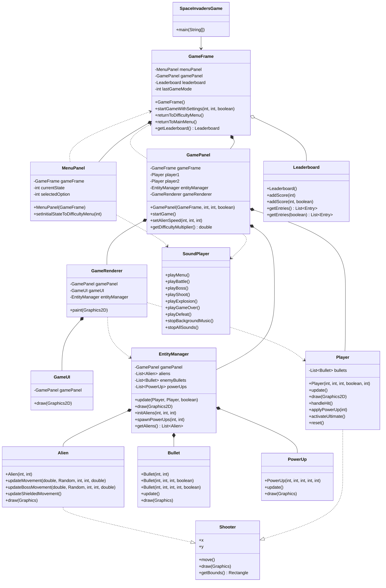

# Space Invaders Project Overview

## UML Class Diagram



## GUI Code Layout

The GUI is split into a few focused Swing classes instead of one large panel.

- `GameFrame` is the top-level `JFrame` and switches between menu and game screens.
- `MenuPanel` owns all menu states, key navigation, and screen drawing for start, controls, about, and leaderboard views.
- `GamePanel` owns the game loop, input handling, state updates, and the `Timer` that drives repainting.
- `GameRenderer` centralizes in-game drawing so `GamePanel.paintComponent` stays small.
- `GameUI` draws HUD elements, pause overlay, and game-over overlay.
- `EntityManager` manages aliens, bullets, power-ups, spawning, and collision-related updates.

Flow summary:

1. `SpaceInvadersGame.main` creates `GameFrame` on the EDT.
2. `GameFrame` starts with `MenuPanel` visible.
3. Menu actions call back into `GameFrame`, which swaps to `GamePanel`.
4. `GamePanel` starts the timer, updates entities, and delegates rendering.
5. Game end returns to the menu and restarts music via `SoundPlayer`.

## API Surface

Public classes exposed by the project:

- `Alien`
- `Bullet`
- `EntityManager`
- `GameFrame`
- `GamePanel`
- `GameRenderer`
- `GameUI`
- `Leaderboard`
- `MenuPanel`
- `Player`
- `PowerUp`
- `Shooter`
- `SoundPlayer`
- `SpaceInvadersGame`

The generated HTML API documentation should be placed under `docs/api/`.

## Build Artifacts

Expected outputs:

- Executable jar: `target/space-invaders-game-1.0.0.jar`
- API docs: `docs/api/`

## Local Build Commands

If Maven is available:

```bash
mvn clean package
mvn javadoc:javadoc
```

If Maven is not available, use the JDK tools directly from `JAVA_HOME`:

```bash
"%JAVA_HOME%\\bin\\javac.exe" -d target/classes src/main/java/com/spaceinvaders/*.java
"%JAVA_HOME%\\bin\\jar.exe" --create --file target/space-invaders-game-1.0.0.jar --main-class com.spaceinvaders.SpaceInvadersGame -C target/classes .
"%JAVA_HOME%\\bin\\javadoc.exe" -d docs/api -sourcepath src/main/java -subpackages com.spaceinvaders
```
