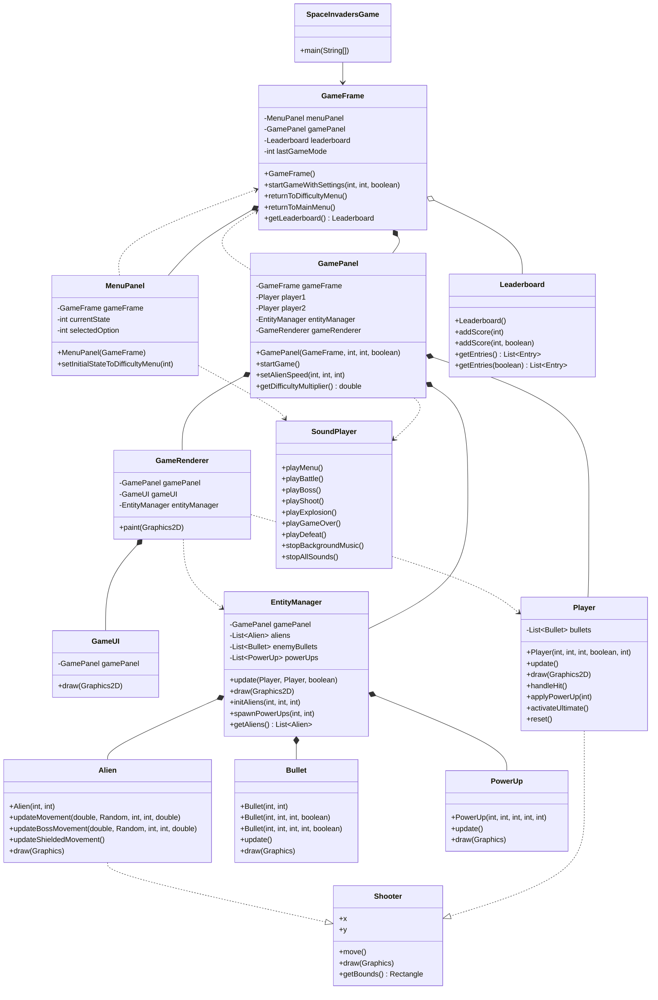

# UML 類別圖

```mermaid
classDiagram
    class SpaceInvadersGame {
        +main(String[])
    }

    class GameFrame {
        -MenuPanel menuPanel
        -GamePanel gamePanel
        -Leaderboard leaderboard
        -int lastGameMode
        +GameFrame()
        +startGameWithSettings(int, int, boolean)
        +returnToDifficultyMenu()
        +returnToMainMenu()
        +getLeaderboard() Leaderboard
    }

    class MenuPanel {
        -GameFrame gameFrame
        -int currentState
        -int selectedOption
        +MenuPanel(GameFrame)
        +setInitialStateToDifficultyMenu(int)
    }

    class GamePanel {
        -GameFrame gameFrame
        -Player player1
        -Player player2
        -EntityManager entityManager
        -GameRenderer gameRenderer
        +GamePanel(GameFrame, int, int, boolean)
        +startGame()
        +setAlienSpeed(int, int, int)
        +getDifficultyMultiplier() double
    }

    class GameRenderer {
        -GamePanel gamePanel
        -GameUI gameUI
        -EntityManager entityManager
        +paint(Graphics2D)
    }

    class GameUI {
        -GamePanel gamePanel
        +draw(Graphics2D)
    }

    class EntityManager {
        -GamePanel gamePanel
        -List~Alien~ aliens
        -List~Bullet~ enemyBullets
        -List~PowerUp~ powerUps
        +update(Player, Player, boolean)
        +draw(Graphics2D)
        +initAliens(int, int, int)
        +spawnPowerUps(int, int)
        +getAliens() List~Alien~
    }

    class Shooter {
        +x
        +y
        +move()
        +draw(Graphics)
        +getBounds() Rectangle
    }

    class Player {
        -List~Bullet~ bullets
        +Player(int, int, int, boolean, int)
        +update()
        +draw(Graphics2D)
        +handleHit()
        +applyPowerUp(int)
        +activateUltimate()
        +reset()
    }

    class Alien {
        +Alien(int, int)
        +updateMovement(double, Random, int, int, double)
        +updateBossMovement(double, Random, int, int, double)
        +updateShieldedMovement()
        +draw(Graphics)
    }

    class Bullet {
        +Bullet(int, int)
        +Bullet(int, int, int, boolean)
        +Bullet(int, int, int, int, boolean)
        +update()
        +draw(Graphics)
    }

    class PowerUp {
        +PowerUp(int, int, int, int, int)
        +update()
        +draw(Graphics)
    }

    class Leaderboard {
        +Leaderboard()
        +addScore(int)
        +addScore(int, boolean)
        +getEntries() List~Entry~
        +getEntries(boolean) List~Entry~
    }

    class SoundPlayer {
        +playMenu()
        +playBattle()
        +playBoss()
        +playShoot()
        +playExplosion()
        +playGameOver()
        +playDefeat()
        +stopBackgroundMusic()
        +stopAllSounds()
    }

    SpaceInvadersGame --> GameFrame
    GameFrame *-- MenuPanel
    GameFrame *-- GamePanel
    GameFrame o-- Leaderboard
    GamePanel *-- Player
    GamePanel *-- EntityManager
    GamePanel *-- GameRenderer
    GameRenderer *-- GameUI
    GameRenderer ..> EntityManager
    GameRenderer ..> Player
    EntityManager *-- Alien
    EntityManager *-- Bullet
    EntityManager *-- PowerUp
    Player ..|> Shooter
    Alien ..|> Shooter
    MenuPanel ..> GameFrame
    GamePanel ..> GameFrame
    GamePanel ..> SoundPlayer
    MenuPanel ..> SoundPlayer
```
