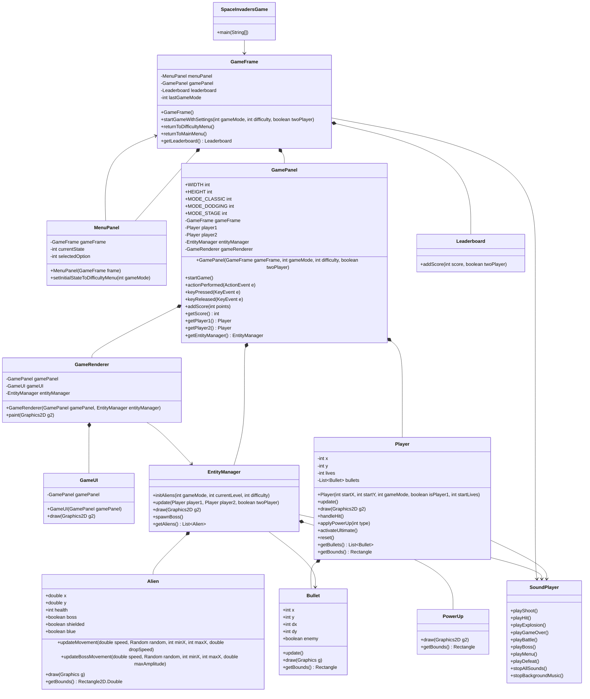

# UML 類別圖

本專題使用 Java Swing 製作 Space Invaders 遊戲。主要類別可分為啟動入口、視窗與 GUI、遊戲邏輯、遊戲物件、音效與排行榜等部分。

```mermaid
classDiagram
    class SpaceInvadersGame {
        +main(String[])
    }

    class GameFrame {
        -MenuPanel menuPanel
        -GamePanel gamePanel
        -Leaderboard leaderboard
        -int lastGameMode
        +GameFrame()
        +startGameWithSettings(int gameMode, int difficulty, boolean twoPlayer)
        +returnToDifficultyMenu()
        +returnToMainMenu()
        +getLeaderboard() Leaderboard
    }

    class MenuPanel {
        -GameFrame gameFrame
        -int currentState
        -int selectedOption
        +MenuPanel(GameFrame frame)
        +setInitialStateToDifficultyMenu(int gameMode)
    }

    class GamePanel {
        +WIDTH int
        +HEIGHT int
        +MODE_CLASSIC int
        +MODE_DODGING int
        +MODE_STAGE int
        -GameFrame gameFrame
        -Player player1
        -Player player2
        -EntityManager entityManager
        -GameRenderer gameRenderer
        +GamePanel(GameFrame gameFrame, int gameMode, int difficulty, boolean twoPlayer)
        +startGame()
        +actionPerformed(ActionEvent e)
        +keyPressed(KeyEvent e)
        +keyReleased(KeyEvent e)
        +addScore(int points)
        +getScore() int
        +getPlayer1() Player
        +getPlayer2() Player
        +getEntityManager() EntityManager
    }

    class GameRenderer {
        -GamePanel gamePanel
        -GameUI gameUI
        -EntityManager entityManager
        +GameRenderer(GamePanel gamePanel, EntityManager entityManager)
        +paint(Graphics2D g2)
    }

    class GameUI {
        -GamePanel gamePanel
        +GameUI(GamePanel gamePanel)
        +draw(Graphics2D g2)
    }

    class EntityManager {
        +initAliens(int gameMode, int currentLevel, int difficulty)
        +update(Player player1, Player player2, boolean twoPlayer)
        +draw(Graphics2D g2)
        +spawnBoss()
        +getAliens() List~Alien~
    }

    class Player {
        -int x
        -int y
        -int lives
        -List~Bullet~ bullets
        +Player(int startX, int startY, int gameMode, boolean isPlayer1, int startLives)
        +update()
        +draw(Graphics2D g2)
        +handleHit()
        +applyPowerUp(int type)
        +activateUltimate()
        +reset()
        +getBullets() List~Bullet~
        +getBounds() Rectangle
    }

    class Alien {
        +double x
        +double y
        +int health
        +boolean boss
        +boolean shielded
        +boolean blue
        +updateMovement(double speed, Random random, int minX, int maxX, double dropSpeed)
        +updateBossMovement(double speed, Random random, int minX, int maxX, double maxAmplitude)
        +draw(Graphics g)
        +getBounds() Rectangle2D.Double
    }

    class Bullet {
        +int x
        +int y
        +int dx
        +int dy
        +boolean enemy
        +update()
        +draw(Graphics g)
        +getBounds() Rectangle
    }

    class PowerUp {
        +draw(Graphics2D g2)
        +getBounds() Rectangle
    }

    class Leaderboard {
        +addScore(int score, boolean twoPlayer)
    }

    class SoundPlayer {
        +playShoot()
        +playHit()
        +playExplosion()
        +playGameOver()
        +playBattle()
        +playBoss()
        +playMenu()
        +playDefeat()
        +stopAllSounds()
        +stopBackgroundMusic()
    }

    SpaceInvadersGame --> GameFrame
    GameFrame *-- MenuPanel
    GameFrame *-- GamePanel
    GameFrame *-- Leaderboard
    MenuPanel --> GameFrame
    GamePanel *-- Player
    GamePanel *-- EntityManager
    GamePanel *-- GameRenderer
    GameRenderer *-- GameUI
    GameRenderer --> EntityManager
    EntityManager *-- Alien
    EntityManager *-- PowerUp
    EntityManager --> Bullet
    Player *-- Bullet
    Player --> SoundPlayer
    EntityManager --> SoundPlayer
    GameFrame --> SoundPlayer
```